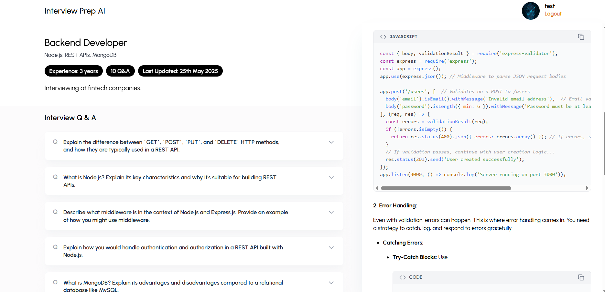

# 🎤 InterVue AI – Your Personal AI Interview Coach

 <!-- Replace with actual path or URL -->

**InterVue AI** is your intelligent interview preparation assistant. Whether you're gearing up for a technical job or behavioral round, InterVue AI simulates real-world interview questions, analyzes your responses, and provides constructive feedback — all powered by AI.

> "Practice like it's the real thing. Prepare with intelligence."

---

## 🔗 Live Demo

🌐 [Try InterVue AI Now](https://your-vercel-url.vercel.app) <!-- Replace with your actual deployment URL -->

---

## 🧠 Project Description

InterVue AI is designed to help job seekers gain confidence and polish their skills through AI-driven mock interviews. It personalizes each session to match the user's field and experience level. From coding problems to HR-style behavioral questions, InterVue AI provides a complete, automated prep experience.

---

## 🛠️ Tech Stack

### 🌐 Frontend (React + Tailwind)
- React 19
- React Router DOM 7
- Tailwind CSS 4
- Axios
- Framer Motion (animations)
- Moment.js (timestamps)
- React Hot Toast (notifications)
- React Markdown + Syntax Highlighter
- React Modal
- React Icons
- Remark GFM (GitHub Flavored Markdown)

### 🧪 Backend (Node.js + Express)
- Express 5
- MongoDB + Mongoose
- bcryptjs (password hashing)
- Multer (file uploads)
- JSON Web Token (JWT)
- dotenv
- cors
- nodemon
- Google GenAI (AI model integration)

---

## ✨ Features

- 🤖 **AI-Powered Interview Simulations** – Real-time Q&A sessions with dynamic feedback.
- 💬 **Behavioral & Technical Questions** – Tailored based on your profile.
- ✅ **Authentication System** – Secure login and registration.
- 📁 **Resume Upload & Parsing** – Let AI tailor questions to your resume.
- 🔒 **JWT Protected Routes** – Secure backend API.
- 🎨 **Clean & Responsive UI** – Optimized for both desktop and mobile devices.
- 🧠 **Syntax Highlighted Feedback** – Especially useful for coding sessions.

---

